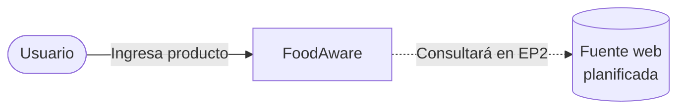
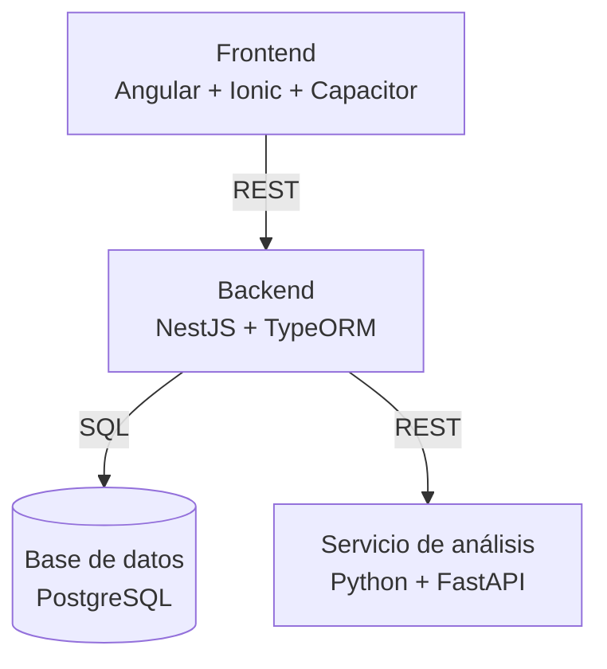
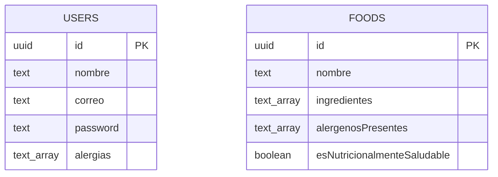

## Diagrama de contexto

## Diagrama de contenedores

## Diagrama de despliegue preliminar

## Modelo de base de datos

> **Nota:** actualmente no tenemos una relación formal entre `users` y `foods` en el esquema ya que no hay columna `userId` en `foods`. La comparación de alergias se hace en tiempo de ejecución pero no queda registrado de qué usuario analizó el producto. Planeamos agregar esta relación en una de las siguientes entregas parciales.