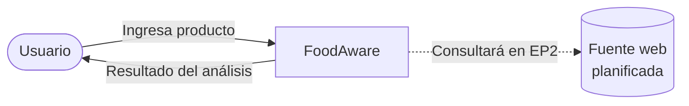
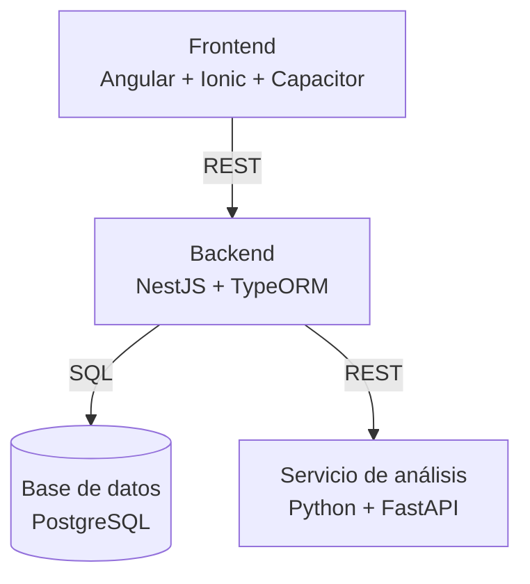
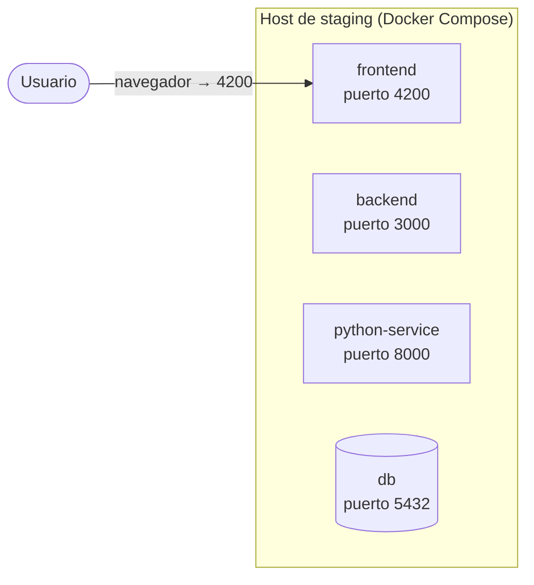
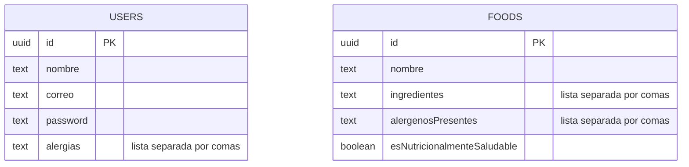

## Diagrama de contexto

## Diagrama de contenedores

## Diagrama de despliegue preliminar

## Modelo de base de datos

## Decisiones de arquitectura

**Servicio Python separado:** el análisis de alérgenos va en un microservicio aparte con FastAPI, pensando en que a futuro podamos usar algo más sofisticado que reglas simples. El costo es una llamada HTTP extra entre NestJS y Python.

**Reglas en vez de un modelo de IA:** la detección de alérgenos compara ingredientes contra una lista conocida, no usa un modelo entrenado. Es más simple y explicable para esta etapa; el límite es que solo detecta lo que está en la lista.

**Listas guardadas como texto separado por comas:** ingredientes y alérgenos se guardan con `simple-array` de TypeORM en vez de tablas relacionadas aparte. Es más simple de implementar, pero hace las búsquedas por ingrediente menos eficientes a futuro.

**IDs tipo UUID:** se usan en vez de números correlativos(como 1,2,3, etc) para que no se puedan adivinar ni usar para acceder a otro registro cambiando un número en la URL y asi sea mucho mas seguro.

**Comunicación entre contenedores por nombre de servicio:** NestJS habla con la base de datos y con Python usando los nombres de servicio de Docker Compose (`db`, `python-service`), no `localhost`, aprendimos esto arreglando un bug real donde `localhost` apuntaba al contenedor equivocado.

**Pipeline que bloquea errores:** el lint, los tests y la auditoría de dependencias detienen el pipeline si fallan.